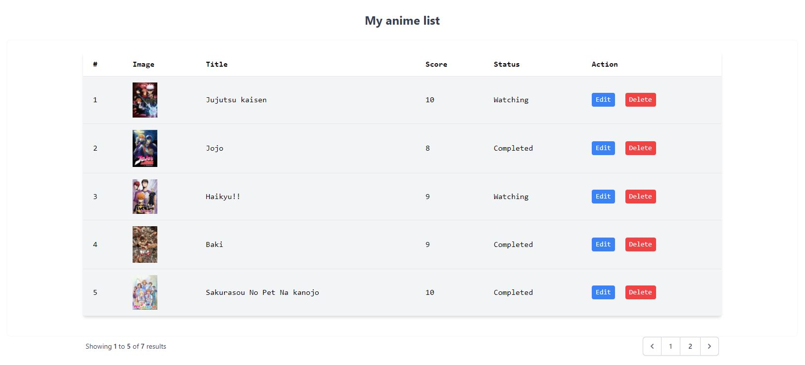

# Implementing CRUD operations using Laravel 8.0 
Because I love Anime I decided I want to build my own AnimeList website where I can store my own series, rate them, change their watching status or delete. 
This project replicates MyAnimeList website by adding, reading, editing and deleting your anime. It's a fun project to work on aswell as learn Laravel. 

The project implements authentication and authorization for users so they can make their own private list of series.
 
Front-end: TailwindCSS

